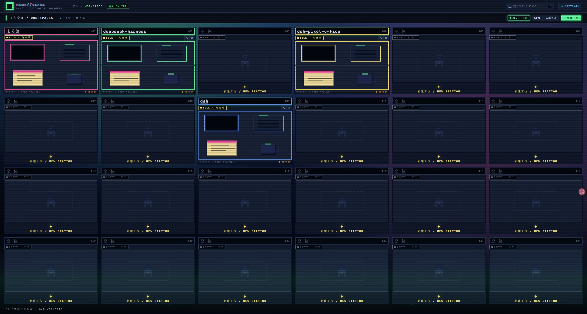
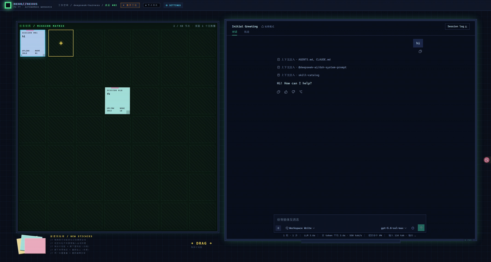
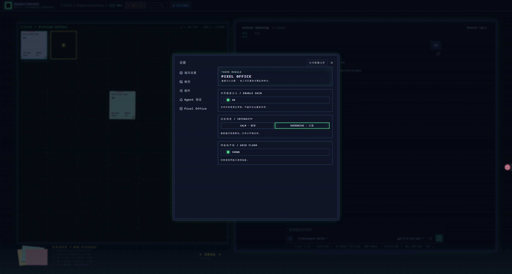

# Pixel Office

A **digital + pixel-art** workspace theme plugin for the [DeepSeek Harness](https://github.com/Doozqoo/deepseek-harness) Web GUI.

[中文版 / Chinese version](./README.md)

It replaces the session list with a top-down pixel office: a 6×4 grid of 24 desks in a 田-shaped layout, one desk per workspace. An empty desk holds nothing but a chair; a workspace that exists gets a computer on its desktop; when a session runs inside that workspace the monitor lights up and flickers. Entering a desk switches to the front view — a planning board on the left covered in sticky notes, each one a session, and a CRT monitor on the right that **holds the real conversation**: chatting, sending, and tool calls all keep working as they do natively.

The theme ships CRT scanlines, a mosaic tile reveal, a CRT power-on transition, a pixel cat that blinks, sticky-note hover lift, and more. The sidebar is clipped away, a HUD bar spans the top of the console, and a neon palette covers the whole interface.

## ⚠️ Version compatibility (read before installing)

**This plugin supports only the latest version of DeepSeek Harness** (≥ `0.1.2-alpha.1`, where the client runtime has been split into `api/*` + `ui/*`). Earlier harness versions are not supported, and no backward compatibility is maintained.

That is not laziness: the `dsh.client.inject` dependency lists of different harness versions are mutually incompatible — the current harness has dropped `@deepseek-ai/dsh-client-runtime`, while older ones lack packages such as `session-controller` / `workspace-controller` — so no single manifest can cover both. **There is exactly one fix: upgrade DeepSeek Harness to the latest version.**

**You must remount the plugin after upgrading the harness** (`dsh.client.inject` is resolved once, when the plugin is added to a profile; restarting `dsh web` does **not** re-read it):

```powershell
dsh plugin --profile web remove dsh-client-pixel-office
dsh plugin --profile web add <absolute path to this repo>
```

## Screenshots

### Top view: the 24-desk grid



Each card shows the desk number, IDLE/LIVE status, sticky-note count, a runtime indicator lamp, and rename / clear buttons. Clicking an empty slot creates a workspace.

### Desk view: planning board + CRT monitor



Entering a desk reveals a full desk: on the left a "MISSION MATRIX" planning board (one sticky note per session, showing its title, a YOU/AI/SYS corner tag, and the real last message), on the right a CRT monitor (black and on standby until you click a note). Along the bottom, a "NEW STICKIES" stack waits to be dragged into an empty board slot.

### Settings: the Pixel Office section in the host panel



The plugin registers its own section inside the host's native settings panel, offering a master switch, an intensity mode (CALM / OVERDRIVE), and a grid toggle.

## Features

| Area | Behaviour |
|---|---|
| **Sidebar** | Clipped out of view rather than `display:none` (so the React subtree is not torn down) |
| **Top-view desks** | 6×4 田-shaped grid; drag to relocate or swap equipment; click an empty slot to create a workspace; rename + clear. The permanent "Ungrouped" desk is pinned to cell 1 and cannot be dragged |
| **Desk planning board** | `ResizeObserver` drives the row/column count; notes are laid out at 156×168, cells fill the space exactly on a `1fr` basis, and one empty slot is always kept |
| **Sticky notes** | One note = one session; click to open it on the CRT; drag to swap position; drag off the board to tear it off (archive). Shows the last message plus a YOU/AI/SYS corner tag |
| **CRT monitor** | Black standby by default when you enter a desk; a note must be clicked before the session is wired up. The open note is highlighted in cyan |
| **New session** | A stack of notes at the bottom-left of the desk; drag one into an empty board slot and a dialog asks for its display text |
| **Settings section** | Registered into `settings.section`: master switch / intensity / grid toggle |
| **Persistence** | Desk layout, note placement, and custom text live in `localStorage` and survive reloads |
| **Appearance** | The plugin's own surface is forced dark (DARK_TOKENS) and does not follow the host appearance; host UI outside the plugin is untouched |
| **Backdrop** | Five parallax layers: drifting aurora, perspective floor with a zenith grid, three layers of pixel dust, vignette and horizon bloom |
| **Animation** | Notes sway out of phase and lift on hover, indicator lamps breathe, CRT scanlines, a CRT power-on transition, and a staggered desk entrance |
| **Mosaic reveal** | Opening a note covers the conversation slot with a theme-coloured mosaic that pops away tile by tile, revealing the real conversation underneath |
| **Pixel cat** | Appears on the monitor only while a session is running in that desk; blinks occasionally at rest; hidden on standby |
| **Intensity tiers** | `CALM` (keeps the palette, stops ambient motion) / `OVERDRIVE` (everything on); honours the host's `prefers-reduced-motion` |
| **Desk sorting** | A "sort" segmented control in the top-view toolbar: **Manual** (default, layout entirely up to dragging) / **Activity** (re-sorts desks by the most recent session activity — applied once, and you can keep dragging afterwards). "Ungrouped" stays pinned to cell 1 |
| **Events** | Subscribes to `connection/reset` (disconnect notice) and `theme/change` (appearance signal) |
| **Version badge** | The top-view bottom status bar and the settings hero show `POWERED BY DSH <harness version>` (e.g. `0.1.2-alpha.1-cd5ef81-dirty`). That is the **host harness** version, not this plugin's — the harness only renders that string in its sidebar brand (`process.env.DSH_CLIENT_VERSION/COMMIT_HASH/GIT_DIRTY`, inlined at build time); there is no cordis service, no `window` global, and no meta tag, so the plugin reads it out of `[data-slot="sidebar"]`. When it cannot be read, the line degrades to `POWERED BY DSH` — it never guesses a version |
| **Services used** | Declared via `export const inject`: `slots` / `theme` / `workspaces` / `uiWorkspace` / `sessions`. The harness plugin guard **hands a plugin only the services it declared**; anything undeclared resolves to `undefined` |

## Installation

Pixel Office is a standard DSH Profile Bundle. Installing means adding a package that declares `dsh.bundle.patch` as a dependency of a dsh profile; dsh then activates it into the `dsh.profile.bundles` layer order. Under the hood the command is a `pnpm add` run inside the current profile directory.

**Prerequisites**

- Node.js 22+ (pinned by `engines`)
- pnpm 10+ (pinned by `packageManager`; corepack recommended)
- **The latest** DeepSeek Harness (≥ `0.1.2-alpha.1`); earlier versions are unsupported — see "Version compatibility" above

**Profile directory**: `$DSH_HOME/profiles/web` by default, or `~/.dsh/profiles/web` when `DSH_HOME` is unset.

After installing, upgrading, or removing you must **restart the running `dsh web` process and reload the browser** — the current Web Profile does not promise hot reload for persisted Bundle layers.

### Install from the GitHub repository

```powershell
npx @deepseek-ai/dsh plugin --profile web add github:Doozqoo/dsh-pixel-office
```

If `@deepseek-ai/dsh` is installed globally you can shorten this to `dsh plugin ...`; inside a Harness source checkout, `pnpm dsh plugin ...` works.

Git dependencies run the package's `prepare` (that is, `pnpm run build`) at install time to build `lib/` in place. pnpm ≥ 10 blocks dependency lifecycle scripts by default: add the exact key pnpm prints to `allowBuilds` in that profile's `pnpm-workspace.yaml`, then re-run the install command (pnpm 11's key is `allowBuilds`; the older `onlyBuiltDependencies` you may find in old docs is deprecated).

> `github:Doozqoo/...` resolves the **repository** name. Once installed into a profile, update/remove take the **package** name `dsh-client-pixel-office`.

### Local development (Harness source + local checkout)

If you have both the DeepSeek Harness source repository and a local checkout of this plugin, link the checkout into the profile as a path dependency:

```powershell
# 1) Build the plugin — the registry loads lib/client.js, not src/
cd D:\...\dsh-pixel-office
pnpm install
pnpm build

# 2) From the Harness source root, add the checkout to the web profile (absolute path)
cd D:\...\deepseek-harness
pnpm dsh plugin --profile web add "D:\...\dsh-pixel-office"
```

A path dependency links to the checkout rather than copying it: after editing the source, re-run `pnpm build` to refresh `lib/` in place, then restart `dsh web` and hard-refresh the page.

> **On Windows, avoid spaces in the path.** `dsh plugin` hands the path to pnpm through a shell on Windows, and a path containing spaces gets truncated — you end up with a broken dependency named something like `Program` or `dsh-pixel-office`, after which `remove <real package name>` reports "no such dependency". For a path with spaces, create a junction first and add that instead:
> ```powershell
> New-Item -ItemType Junction -Path "C:\Users\you\dsh-pixel-office" `
>   -Target "D:\...\dsh-pixel-office" -Force
> node --import tsx/esm apps\cli\src\bin.ts plugin --profile web add `
>   "C:\Users\you\dsh-pixel-office"
> ```

To confirm the plugin made it into the layer order, check the profile's `package.json` dependencies and the `dsh.profile.bundles` list, or run `pnpm dsh --profile web --dump-config` and look for `pixel-office` in the composed entry tree.

### A note on collaborating around DeepSeek Harness

`deepseek-harness` is the **official repository**. Any change you make to it locally — for example session cascade-archiving when a workspace is deleted, or layout reconcile logic — **lives only in your local checkout**: it is neither shared with other collaborators nor merged upstream.

That means compatibility issues are **unavoidable** when developing Pixel Office on top of local harness changes:

- Other collaborators run stock upstream harness without your local cascade-archive / layout-reconcile fixes, so their behaviour may not match yours.
- The host behaviour the plugin relies on (interfaces, slots, events) is **whatever the running harness does**; `contracts.ts` is only a structural mirror, and it has to be realigned by hand whenever upstream moves.
- Local harness fixes that are never sent upstream will drift further from upstream over time, and the merge cost only grows.

**When you hit a related problem, please follow these conventions:**

1. **Send fixes upstream first.** Contribute harness-side fixes back as a PR or commit instead of keeping a permanent fork only in your local downstream.
2. **Be explicit about "local-only patch" vs "upstream common behaviour".** Keep collaborators in the loop, so an upstream behaviour is not misread as a plugin bug — nor a local patch mistaken for a general capability.
3. **Confirm whether the other side's harness contains your local change before assigning blame.** When triaging a compatibility issue, align on both harness states first, then decide whether it is really a Pixel Office problem.

## Upgrading

```powershell
npx @deepseek-ai/dsh plugin --profile web update dsh-client-pixel-office
```

For a GitHub install you can also re-run the `add` command; pnpm will update the locked Git revision. In local path development there is no "upgrade": editing the source and running `pnpm build` *is* the new version.

## Uninstalling

```powershell
npx @deepseek-ai/dsh plugin --profile web remove dsh-client-pixel-office
```

`remove` drops the profile dependency and takes the plugin out of the layer order. After restarting `dsh web`, Cordis withdraws the stylesheet, the theme overrides, and the slot registrations, and the native interface comes back intact. Layout preferences in `localStorage` are kept by default so a reinstall picks up where you left off; clear them through your browser's site data settings if needed.

## Configuration (settings panel)

The plugin registers a `settings.section` (label "Pixel Office") in the host's **native settings panel**. Open SETTINGS in the top-right corner → "Pixel Office":

| Option | Range | Notes |
|---|---|---|
| **ENABLE SKIN** | `ON` / `OFF` | Master switch. Turning it off removes the styles, the token overrides, and the scene overlay together, restoring the native interface; the panel itself stays reachable so you can turn it back on |
| **INTENSITY** | `CALM` / `OVERDRIVE` | CALM keeps the palette and only stops ambient motion; OVERDRIVE enables every animation |
| **GRID FLOOR** | `SHOWN` / `HIDDEN` | Toggles the top-down grid and the perspective floor |

The number of sticky notes no longer needs tuning: the board fills whatever space is available — roughly 11 notes at 1280×800, 30 at 1920×1080, 56 at 2560×1440 — and re-flows automatically when the window is resized.

## Persistence

| Field | Stored in | Contents | Cross-browser |
|---|---|---|---|
| Desk layout | `localStorage` | Render order of the 6×4 desks | No |
| Note placement | `localStorage` | Session order of the note cells within each workspace | No |
| Custom text | `localStorage` | Display text on the notes | No |
| Motion preference | `localStorage` | `intensity` / `grid` | No |
| `opened` | Not persisted | The note currently open | — |

`opened` ("which note was opened this visit") is deliberately **not** persisted, so a reload always starts from the black standby screen. Persistence writes are reference-compared: dragging 50 times writes to storage at most 0 times. In private browsing mode, a storage error degrades silently to memory-only.

## Layout

```
src/index.ts            node half (placeholder apply; the Loader needs an importable row)
src/client/index.tsx    browser entry: service reads, slot registration, lifecycle
src/client/views.tsx    top view, desk view, dialogs, settings panel
src/client/styles.ts    stylesheet text + injection effect
src/client/tokens.ts    light and dark palettes
src/client/placement.ts placement and presentation logic (no React, no DOM)
src/client/store.ts     scene state and pointer dragging
src/client/persist.ts   placement persistence (localStorage read/write and validation)
src/client/contracts.ts structural types for the DSH surfaces it needs
src/client/version.ts   reads the host harness version out of the sidebar badge
assets/                 README screenshots (top-view / desk-view / settings)
tsdown.config.ts        artifact build config
```

`placement.ts` deliberately contains no React and no DOM, which makes it the only part testable outside a browser. `contracts.ts` declares the needed types locally instead of importing them from `@deepseek-ai/*` — a standalone repository must be installable and typecheckable without those packages. These are structural mirrors, not an upstream API fork; if they disagree with the running harness, the harness is right.

## Development

```powershell
pnpm install              # install dependencies
pnpm build                # typecheck + tsdown bundle (output in lib/)
pnpm typecheck            # tsc -b --force
```

Build artifacts (`lib/client.js`, `lib/index.js`, `.d.ts`, sourcemaps) are produced by tsdown in one pass. It is plug-and-play: the dev server reads `lib/client.js`, not `src/`.

After editing `src/` you must run `pnpm build` and then **restart `dsh web` and hard-refresh the browser** — third-party plugins have no HMR, so otherwise you are still running the old bundle.

### Two hard rules for anyone extending this

1. **A service must be declared before you can get it.** The harness `cordis-client-runner` guard hands a plugin only the services its fiber declared in `export const inject`; `ctx.get` returns `undefined` for anything else. Add the service name to `inject` before building a new capability.
   > Debugging tip: temporarily add `console.log(typeof ctx.get('<service name>'))` and bisect round by round — "whatever is `undefined`, declare it". **Do not judge from `cordis.patch.yml` alone**: a controller service being listed in the bundle does not mean a plugin's `ctx` can `get` it.
2. **`ctx.remote` is off limits.** Host Remote belongs to `@deepseek-ai/dsh-api-gateway`, and neither `api-gateway` nor `typert` is part of the web composition; the guard blocks it outright, so merely writing `ctx.get('remote')` throws
   `cannot get property "remote.workspace" without inject`.
   Route every mutation through the three direct services `workspaces` / `uiWorkspace` / `sessions`.

## Publishing

```powershell
npm login                    # first time: log in to npm (have your TOTP ready for 2FA)
pnpm publish --dry-run       # check which files land in the tarball (lib/ and cordis.patch.yml must be there)
pnpm publish                 # publish for real (runs prepare, which builds lib/)
```

npm never lets a version be overwritten: run `npm version patch|minor|major` before each `pnpm publish`. The package `dsh-client-pixel-office` is unscoped and therefore public by default — no `--access public` needed.

## Known limitations

- **Persistence is per-browser.** Switching browsers or clearing site data falls back to the defaults.
- **The top view is fixed at 24 desks, and cell 1 (top-left) is permanently the "Ungrouped" desk**, showing sessions that no workspace has claimed (matching the official UI's "Ungrouped" group). The other 23 cells hold real workspaces; workspaces beyond that still exist and remain reachable from the native interface, they simply have no desk. The Ungrouped desk can be entered and its sessions can be continued or dragged out to archive, but the desk itself is read-only: it cannot be renamed, cleared, or deleted, and no session can be created under it — the official UI offers no way to create a workspace-less session, and the plugin stays consistent with that rather than extending it.
- **When the host is in light mode, the conversation interior (rendered by the host) still follows the host theme**, which may clash with the plugin's forced-dark CRT bezel. Code blocks, tables, and inputs have fallback rules, but coverage is not guaranteed to be complete.
- **The model / agent preset sections are only skinned** (square corners + monospace font); their inner controls have not been verified one by one.
- **No automated tests yet.** `placement.ts` was factored out to be testable, but the tests are unwritten — PRs welcome.

## License

MIT — see [LICENSE](./LICENSE).
